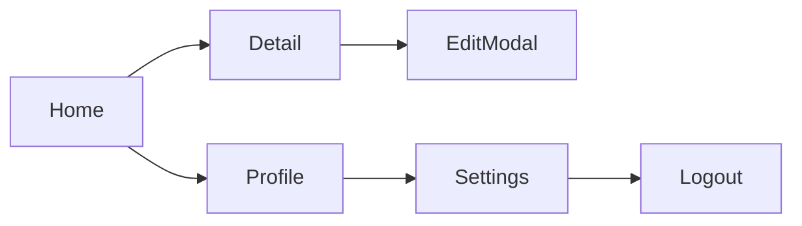

# Exploration Protocol (Phase 1 of full-functional-audit)

This reference is loaded by Phase 1 (EXPLORE — Build Interaction Inventory) of `full-functional-audit`. It expands the discovery commands, inventory schema, and prioritization rules used to build a complete map of every interaction in the app before any validation begins.

The audit is only as good as the inventory. A missed screen is a missed bug.

## The output: an interaction inventory

The deliverable of Phase 1 is a Markdown file at `e2e-evidence/<run-id>/audit/INVENTORY.md` with one row per interaction. The downstream Phase 2 (PLAN) and Phase 3 (EXECUTE) consume this file.

Inventory row schema:

```
| ID | Screen | Interaction | Trigger | Backend Dep | Priority |
| A001 | HomeView | Tap "Start" button | Top-right button | POST /sessions | P0 |
| A002 | HomeView | Pull to refresh | Vertical swipe down | GET /sessions | P0 |
| A003 | SessionDetailView | Tap session row | List cell tap | GET /sessions/:id | P0 |
| ... |
```

Columns:
- **ID** — sequential, used in evidence file names later
- **Screen** — the View / Page name from the codebase
- **Interaction** — what the user does (verb + object)
- **Trigger** — UI affordance the user touches (button, gesture, deep link)
- **Backend Dep** — endpoint(s) the interaction hits, or "(local)" if none
- **Priority** — P0 (core flow), P1 (secondary feature), P2 (edge case / rare path)

## Phase 1.1 — Screen discovery

Find every View / Page / Screen / Route in the codebase.

### iOS / SwiftUI

```bash
# Top-level Views — likely root navigation destinations
grep -rln 'struct [A-Z][a-zA-Z]*View: View' --include='*.swift' \
  | sort -u > "$INV/all-views.txt"

# Navigation destinations
grep -rn '\.navigationDestination(' --include='*.swift' > "$INV/nav-destinations.txt"

# NavigationLink targets
grep -rn 'NavigationLink' --include='*.swift' > "$INV/nav-links.txt"

# Sheets / popovers / fullScreenCover
grep -rn '\.sheet(\|\.popover(\|\.fullScreenCover(\|\.alert(' --include='*.swift' \
  > "$INV/modal-presentations.txt"

# Tab bar items
grep -rn 'TabView\|\.tabItem' --include='*.swift' > "$INV/tabs.txt"

# Deep link handlers
grep -rn 'onOpenURL\|\.handlesExternalEvents' --include='*.swift' > "$INV/deep-links.txt"
```

### Web (React / Vue / Svelte / Next)

```bash
# Route definitions
grep -rn 'createBrowserRouter\|<Route \|<Routes>' --include='*.tsx' --include='*.jsx' \
  > "$INV/routes.txt"

# Next.js app router pages
find app -name 'page.tsx' -o -name 'page.jsx' 2>/dev/null > "$INV/pages.txt"

# Next.js pages router
find pages -type f \( -name '*.tsx' -o -name '*.jsx' \) 2>/dev/null \
  | grep -v _app | grep -v _document | grep -v api/ \
  >> "$INV/pages.txt"

# Modal / dialog components
grep -rn '<Dialog\|<Modal\|<Drawer\|<Popover' --include='*.tsx' --include='*.jsx' \
  > "$INV/modals.txt"
```

### Backend (any platform)

```bash
# Find all registered routes — language-specific patterns
# Express / Fastify / Koa
grep -rnE "(app|router)\.(get|post|put|patch|delete)\(" --include='*.ts' --include='*.js' \
  > "$INV/api-routes.txt"

# FastAPI
grep -rnE '@(app|router)\.(get|post|put|patch|delete)' --include='*.py' \
  >> "$INV/api-routes.txt"

# Go (net/http or chi/gin/echo)
grep -rnE '(HandleFunc|Get|Post|Put|Delete)\(' --include='*.go' \
  >> "$INV/api-routes.txt"

# Vapor (Swift)
grep -rnE '\.(get|post|put|delete)\(' --include='*.swift' \
  | grep -v 'view\|sheet\|popover' \
  >> "$INV/api-routes.txt"
```

After raw grep, manually de-dupe and confirm each route is actually mounted (not just defined).

## Phase 1.2 — In-screen interaction discovery

For each Screen identified in Phase 1.1, find every interaction inside it.

```bash
# Per-screen grep within the screen's file
SCREEN_FILE="Sources/Views/HomeView.swift"

# Tap actions
grep -nE 'Button\(|\.onTapGesture|onTap|\.tapAction' "$SCREEN_FILE"

# Long-press, context menus, swipe actions
grep -nE '\.contextMenu|\.swipeActions|\.onLongPressGesture' "$SCREEN_FILE"

# Toggles, switches, sliders
grep -nE 'Toggle\(|Stepper\(|Slider\(' "$SCREEN_FILE"

# Navigation triggers
grep -nE 'NavigationLink|navigationDestination|push\(' "$SCREEN_FILE"

# Modal triggers
grep -nE '\.sheet|\.popover|\.alert|\.confirmationDialog|\.fullScreenCover' "$SCREEN_FILE"

# API calls from inside the screen
grep -nE 'apiClient\.|fetch\(|URLSession|.get\(|.post\(' "$SCREEN_FILE"
```

For each interaction, document:
- Trigger (UI affordance the user touches)
- Action (what the code does on trigger)
- Expected result (state change, navigation, UI feedback)
- Backend dependency (endpoint hit, if any)

## Phase 1.3 — Cross-reference frontend ↔ backend

Every API call from the frontend should match a route in the backend. Mismatches are real bugs hiding in plain sight.

```bash
# Extract endpoints from the frontend
grep -rEho '(apiClient\.|fetch\()["'"'"'][/A-Za-z0-9_-]*["'"'"']' --include='*.ts' --include='*.tsx' \
  | sed -E 's/.*["'"'"']([^"'"'"']+)["'"'"']/\1/' \
  | sort -u > "$INV/frontend-endpoints.txt"

# Extract endpoints from the backend
grep -rEho '\.(get|post|put|patch|delete)\(["'"'"'][/A-Za-z0-9_:-]*["'"'"']' --include='*.ts' \
  | sed -E 's/.*["'"'"']([^"'"'"']+)["'"'"']/\1/' \
  | sort -u > "$INV/backend-endpoints.txt"

# Find mismatches
comm -23 "$INV/frontend-endpoints.txt" "$INV/backend-endpoints.txt" \
  > "$INV/orphan-frontend-calls.txt"
comm -13 "$INV/frontend-endpoints.txt" "$INV/backend-endpoints.txt" \
  > "$INV/orphan-backend-routes.txt"
```

Flag any entry in `orphan-frontend-calls.txt` as a CRITICAL inventory problem — the frontend will get 404 at runtime. Entries in `orphan-backend-routes.txt` are dead code or untested surface — log but not block.

## Phase 1.4 — Priority assignment

Once interactions are enumerated, assign priority based on user impact and frequency.

### P0 — Core flow

- Authentication (sign in, sign up, sign out, password reset)
- Primary value-proposition action (the user's reason to open the app)
- Payment / checkout
- Data-creating primary action (compose, upload, post, save)
- Navigation between the top 3 most-used screens

### P1 — Secondary feature

- Settings / preferences
- Profile / account management
- Search and filters
- Notifications
- Sharing
- Secondary data views (lists, detail pages not on the top-3 path)

### P2 — Edge case

- Onboarding (only seen once per user)
- Empty states
- Error recovery flows
- Admin / debug surfaces
- Deeply nested settings (5+ taps from home)

A complete audit covers P0 + P1. P2 is best-effort. Time pressure reduces P2 first.

## Phase 1.5 — Write the inventory

```markdown
# Interaction Inventory — <project name>

Generated: <timestamp>
Source: codebase at <commit-sha>
Total screens: N
Total interactions: N
P0: N | P1: N | P2: N

## Screen map



## Interactions

| ID | Screen | Interaction | Trigger | Backend Dep | Priority |
|---|---|---|---|---|---|
| A001 | HomeView | Tap "New Session" | Top-right + button | POST /sessions | P0 |
| ... |

## Orphan API calls (CRITICAL)

- POST /agent-queue called from SessionDetailView:42, no matching backend route

## Notes

- Onboarding flow exists at OnboardingView.swift but only fires once per user; manual reset to test.
- DeepLinks: myapp://session/:id, myapp://settings/notifications
```

## Quality checks before exiting Phase 1

- Every Screen in the codebase appears in the inventory at least once
- Every API endpoint in the backend appears either as "tested via inventory item" or as orphan
- Orphan frontend calls are flagged (any → CRITICAL)
- Deep links are enumerated
- The Mermaid screen map renders (no syntax errors)
- Priority distribution is sensible (not all P0, not all P2)

If any check fails, return to the relevant sub-step. Phase 2 (PLAN) cannot proceed against an incomplete inventory.

## Common exploration mistakes

| Mistake | Why it's wrong | Do instead |
|---|---|---|
| Grep for just `Button` and call it done | Misses gestures, swipes, deep links, system menus | Run the full grep set; cross-check with screenshots from existing manual testing |
| Assume "small app, just 5 screens" without grepping | Hidden settings, admin tools, dev menus get missed | Always grep — codebase is the source of truth |
| Skip backend cross-reference | Orphan calls are the #1 audit finding | Always run the comm diff between front and back endpoints |
| Inventory only what's currently routable | Dead screens that get linked later are silently untested | Inventory everything; mark dead screens separately, don't drop them |
| Treat "View" suffix as the only signal | Some screens are named "Page", "Screen", "Detail" | Grep multiple suffixes |

## Output handoff to Phase 2

The inventory is the input to Phase 2's resource-grouping. Specifically Phase 2 reads:
- Total interaction count → team size decision
- Backend-Dep column → which interactions need backend running
- Priority column → P0 must validate first

The inventory file path is passed to Phase 2 by convention: `e2e-evidence/<run-id>/audit/INVENTORY.md`.
